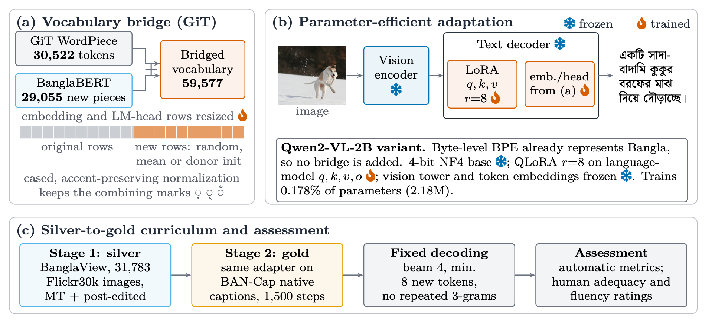

# Bridging the Vocabulary Gap for Bangla Image Captioning

This repository contains the experimental code for a study of parameter-efficient adaptation of vision--language models (VLMs) for Bangla image captioning. The study asks a practical question: when a captioning model cannot represent Bangla well, is the main obstacle adapter capacity, vocabulary coverage, training data, or some combination of these factors?

The experiments include a controlled GiT vocabulary-bridging ablation, Qwen2-VL-2B QLoRA baselines, a silver-to-gold curriculum, automatic evaluation on BAN-Cap, and a small blinded human-evaluation pilot.

## Method overview



**(a)** GiT's WordPiece vocabulary is extended with BanglaBERT wordpieces; the input-embedding and LM-head matrices are resized, and the new rows are initialized randomly, from the mean, or from donor embeddings. **(b)** The bridged GiT is adapted with LoRA on the text-decoder `q,k,v` projections while the resized embeddings and head are trained; Qwen2-VL-2B already represents Bangla and is adapted with 4-bit QLoRA. **(c)** The adapter is trained on silver BanglaView captions, then on native BAN-Cap captions, decoded with one fixed configuration, and scored with automatic metrics and human ratings. The figure shows design settings only, not results. Example image from Flickr8k.

## Main findings

1. **Vocabulary coverage is a concrete bottleneck for an English-tokenized captioner.** On 2,000 BAN-Cap Bangla captions, extending GiT's tokenizer with BanglaBERT wordpieces reduced mean tokenizer fertility from **4.155** to **1.176** tokens per Bangla token and increased round-trip recovery from **78.20%** to **91.18%**.
2. **A larger, multilingual decoder benefits from adaptation even with a small trainable fraction.** Qwen2-VL-2B attention-only QLoRA trained on BAN-Cap obtained BLEU-1 **0.532**, BLEU-4 **0.082**, CIDEr **0.300**, and BERTScore-F1 **0.804** on the 809-image BAN-Cap validation split.
3. **Silver pretraining followed by a short native-data stage improved the reported automatic metrics.** The BanglaView-to-BAN-Cap curriculum reached BLEU-1 **0.558**, BLEU-4 **0.108**, CIDEr **0.354**, and BERTScore-F1 **0.812**. It used 6,000 silver-data steps followed by 1,500 native BAN-Cap steps.
4. **M-CLIPScore is not a language-fidelity measure by itself.** A zero-shot Qwen2-VL-2B system produced no Bangla output on the evaluated split yet received M-CLIPScore **0.803**; adapted Bangla-output systems scored around **0.56**. Reference-based metrics and human judgment are therefore necessary when target-language fidelity matters.

These results are experimental observations, not a claim of state-of-the-art performance. The Qwen and GiT runs differ in architecture, pretraining, and scale; they should not be interpreted as a single-variable model comparison.

## Data and evaluation

- **BAN-Cap:** native Bangla captions paired with Flickr8k images. The standard full run uses 7,282 training images and 809 validation images, with five native references per validation image.
- **BanglaView:** a larger Bangla caption resource used as the silver-data stage of the curriculum.
- **BanglaLekha-Image-Captions:** retained for earlier real-data pipeline experiments.
- **Automatic metrics:** BLEU-1--4, CIDEr, BERTScore-F1 (`bert-base-multilingual-cased`), and M-CLIPScore (`clip-ViT-B-32-multilingual-v1`).
- **Human evaluation:** a blinded pilot pack covering 20 BAN-Cap validation images and four caption systems (80 image--caption judgments per completed rater set). The app is in [`annotation_app/`](annotation_app/).

Raw datasets, checkpoints, generated-caption dumps, and completed human-rating files are deliberately not committed to this repository. The reported human metric-correlation analysis should be treated as a pilot result: the de-identified individual ratings and correlation script are not yet released here.

## Repository layout

```text
configs/          Experiment configurations
src/              Reusable data, model, tokenizer, training, and evaluation code
scripts/          Command-line entry points
notebooks/        Colab-oriented setup and orchestration
annotation_app/   Static React app for the blinded human-evaluation pilot
assets/           README figures
paths.py          Central resolver for datasets, checkpoints, and run outputs
```

## Setup

Use Python 3.10+ with a CUDA-enabled PyTorch installation appropriate for your machine, then install the remaining dependencies:

```bash
python -m venv .venv
source .venv/bin/activate              # Windows: .venv\\Scripts\\activate
pip install -r requirements.txt
```

Large artifacts live outside the Git working tree. Set `BANGLA_VLM_ROOT` to an artifact directory, or use the repository's `_local_data/` fallback:

```bash
export BANGLA_VLM_ROOT=/path/to/bangla-vlm-artifacts
```

Expected artifact locations are resolved by [`paths.py`](paths.py). Place datasets under `data/raw/`, checkpoints under `experiments/checkpoints/`, and generated outputs under `experiments/results/` within that artifact root.

## Reproducing key runs

The commands below require the corresponding dataset files and, where applicable, prior-stage adapters.

```bash
# Tokenizer audit on BAN-Cap captions
python scripts/tokenizer_audit.py --config configs/tokenizer_audit_bancap.yaml

# Controlled GiT vocabulary-bridging ablation
python scripts/git_bridged_ablation.py --config configs/git_bridged_ablation.yaml

# Qwen2-VL-2B BAN-Cap-only QLoRA baseline
python scripts/qwen_qlora_train.py --config configs/qwen_qlora_bancap.yaml

# BanglaView silver-data stage, then native BAN-Cap continuation
python scripts/qwen_qlora_train.py --config configs/qwen_qlora_banglaview.yaml
python scripts/qwen_qlora_train.py --config configs/qwen_qlora_curriculum.yaml

# Score the curriculum adapter on BAN-Cap validation data
python scripts/score_captions.py --config configs/score_qwen_curriculum.yaml

# Create the blinded human-evaluation pack
python scripts/build_human_eval_pilot.py --config configs/human_eval_pilot.yaml
```

## Limitations

- The reported automatic metrics are tied to the specified BAN-Cap split, decoding settings, and available artifacts.
- The GiT bridge is a controlled study of vocabulary representation; it is not a competitive captioning system on its own.
- The curriculum comparison supports the usefulness of the tested silver-to-gold schedule, but does not isolate every factor that may affect performance.
- Human evaluation is a small pilot rather than a validated benchmark, and the raw annotations are not released in this repository.

## Citation

The accompanying manuscript is being prepared. Until a persistent paper identifier is available, cite this repository and state the commit used for the experiments you reproduce.
